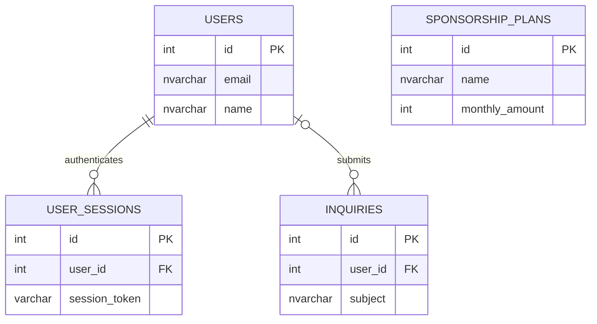

# ERD 요약

```mermaid
erDiagram
  USERS ||--o{ USER_SESSIONS : authenticates
  USERS o|--o{ INQUIRIES : submits
  SPONSORSHIP_PLANS {
    int id PK
    nvarchar name
    int monthly_amount
  }
  USERS {
    int id PK
    nvarchar email
    nvarchar name
  }
  USER_SESSIONS {
    int id PK
    int user_id FK
    varchar session_token
  }
  INQUIRIES {
    int id PK
    int user_id FK
    nvarchar subject
  }
```