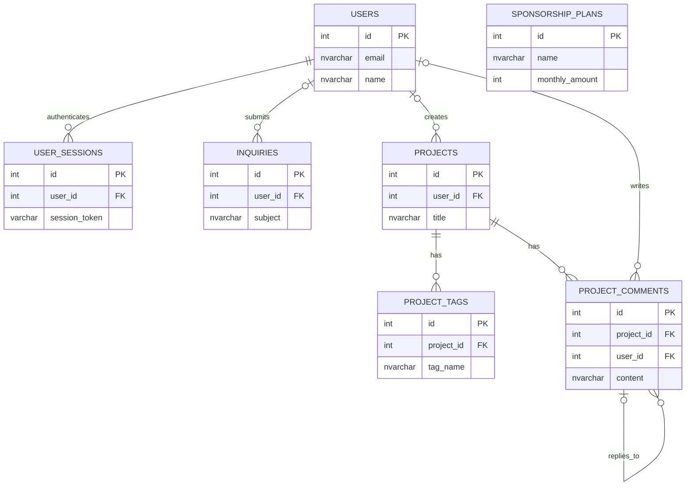

# ERD 요약

```mermaid
erDiagram
  USERS ||--o{ USER_SESSIONS : authenticates
  USERS o|--o{ INQUIRIES : submits
  USERS o|--o{ PROJECTS : creates
  PROJECTS ||--o{ PROJECT_TAGS : has
  PROJECTS ||--o{ PROJECT_COMMENTS : has
  USERS o|--o{ PROJECT_COMMENTS : writes
  PROJECT_COMMENTS o|--o{ PROJECT_COMMENTS : replies_to
  SPONSORSHIP_PLANS {
    int id PK
    nvarchar name
    int monthly_amount
  }
  USERS {
    int id PK
    nvarchar email
    nvarchar name
  }
  USER_SESSIONS {
    int id PK
    int user_id FK
    varchar session_token
  }
  INQUIRIES {
    int id PK
    int user_id FK
    nvarchar subject
  }
  PROJECTS {
    int id PK
    int user_id FK
    nvarchar title
  }
  PROJECT_TAGS {
    int id PK
    int project_id FK
    nvarchar tag_name
  }
  PROJECT_COMMENTS {
    int id PK
    int project_id FK
    int user_id FK
    nvarchar content
  }
```